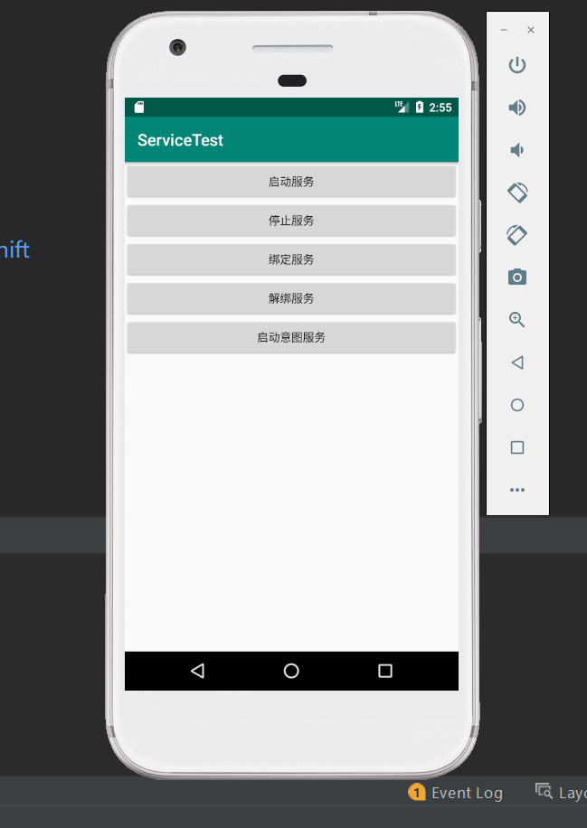

# 服务启动与停止 服务绑定

# 服务启动

创建一个名为MyService服务，MyService是继承Service类的，说明是个服务。在这个类中重写onCreate(), onStartCommand(), onDestroy()3个方法，当服务创建时会调用onCreate()方法，当服务启动时会调用onStartCommand()方法，在服务被销毁时调用onDestroy()方法.
 运行程序，点击“启动服务”按钮，MyService中的onCreate(), onStartCommand()方法会被调用

 再点击“停止服务”按钮，调用onDestroy()方法,此时服务停止

# 绑定服务
服务的绑定 绑定服务，需要重写onBind()方法，并且返回一个IBinder()对象，该IBinder客户端再绑定服务成功后可以获取一个该对象，因此客户端可以通过IBinder来控制服务，IBinder是一个接口，一般我们不会直接实现该接口，而是会继承Binder类。
这里新建一个DownloadBinder类来继承Binder。

	public class MyService extends Service {
	private DownloadBinder mBinder = new DownloadBinder();
	class DownloadBinder extends Binder{
    public void startDownload(){
        Log.d("MyService","startDownload executed");
    }

    public int getProgress(){
        Log.d("MyService","getProgress executed");
        return 0;
    }
    }
	@Override
	public IBinder onBind(Intent intent) {
	    return mBinder;
	}

创建一个ServiceConnection的匿名类，在里面重写了onServiceConnected()方法和onServiceDisconnect()方法，这两个方法分别会在活动与服务绑定成功以及活动与服务的连接断开时调用
在"绑定服务"按钮中的点击事件里完成活动与服务的绑定这个功能，构建出一个Intent对象，然后调用bindService()方法，将MainActivity和MyService进行绑定
	private MyService.DownloadBinder downloadBinder;
	
	private ServiceConnection connection = new ServiceConnection() {
	    @Override
	    public void onServiceConnected(ComponentName componentName, IBinder service) {
	        downloadBinder = (MyService.DownloadBinder) service;
	        downloadBinder .startDownload();
	        downloadBinder.getProgress();
	    }
	    @Override
	    public void onServiceDisconnected(ComponentName componentName) {
	    }
	};
	
	
	
	    Button unbindService = (Button)findViewById(R.id.unbind_service);
	    Button startIntentService =(Button)findViewById(R.id.start_intent_service);
	    bindservice.setOnClickListener(this);
	    unbindService.setOnClickListener(this);
	
	
	    case R.id.bind_service:
	        Intent bindIntent = new Intent(this,MyService.class);
	        bindService(bindIntent,connection ,BIND_AUTO_CREATE);
	        break;
	    case R.id.unbind_service:
	        unbindService(connection);
	        break;

