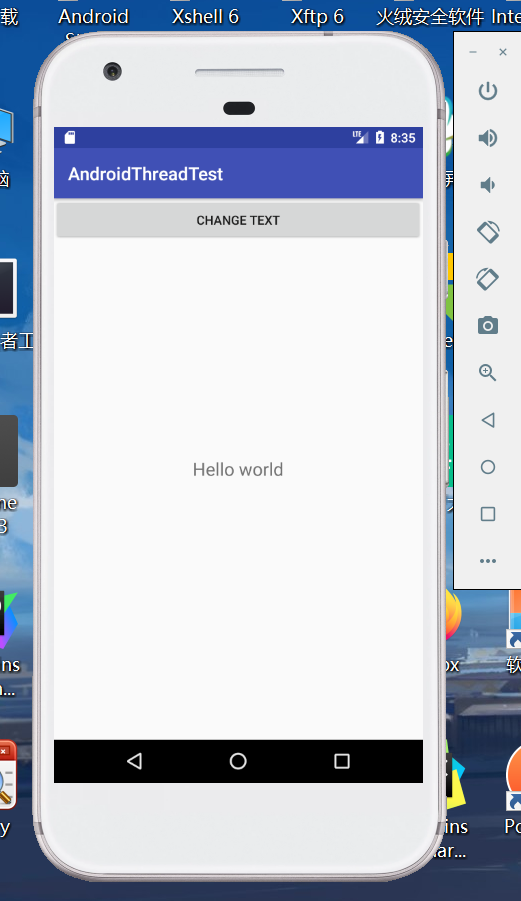
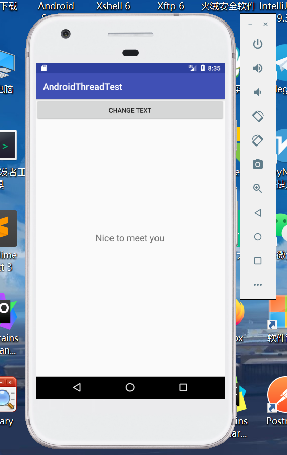

# 多线程数据交换，消息处理
## 效果预览
 
 

## 说明
Android不允许在子进程中进行UI操作，当我们在子进程中更新UI，程序会直接崩溃。所以Android提供了一套异步消息机制来解决在子进程中进行UI操作的问题。
***
   public static final int UPDATA_TEXT=1;
    private Handler handler = new Handler(){
        public void handleMessage(Message message){
            switch (message.what){
                case UPDATA_TEXT:
                    text.setText("hello word");
                    break;
                default:
                    break;
            }
        }

		switch(v.getId()){
            case R.id.button:
                new Thread(new Runnable() {
                    @Override
                    public void run() {
                        //text.setText("nice to meet you");
                        Message message = new Message();
                        message.what = UPDATA_TEXT;
                        handler.sendMessage(message);
                    }
                }).start();
                break;
***
当点击“更改文本”按钮时，文本显示的“hello world”就会被替换成“nice to meet you”   
