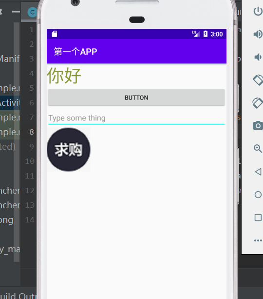
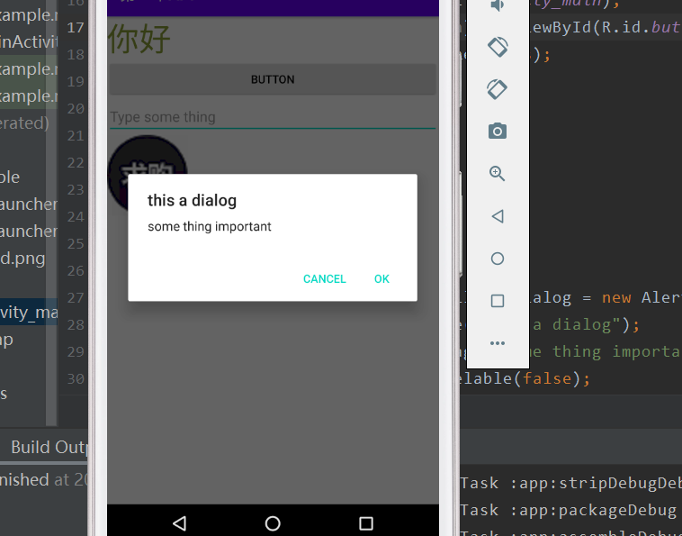

# 练习和掌握android的几种常用的控件：TextView、Button、EditText、ImageView、AlertDialog，了解和熟悉几种布局
## 实验图片截图

## 说明
整体采用垂直布局上面是一个TextView,内容为“你好”。 
接下来是一个水平布局，一个Button。绑定alerdialog，
点击则弹出dialog 
然后是editView。 
然后是一个imageView， 
下面是AlerDialog，AlertDialog可以在当前的界面弹出一个对话框，这个对话框是置顶与所有界面元素之上的，能够屏蔽其他控件的交互能力，因此AlertDialog一般都是用于提示一些非常重要的内容或者警告信息

