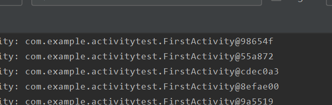
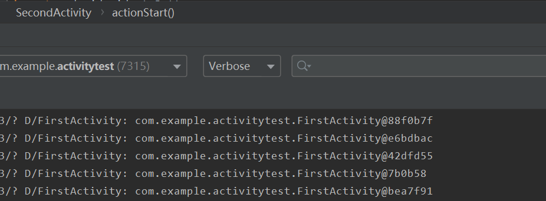
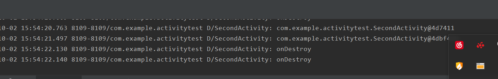
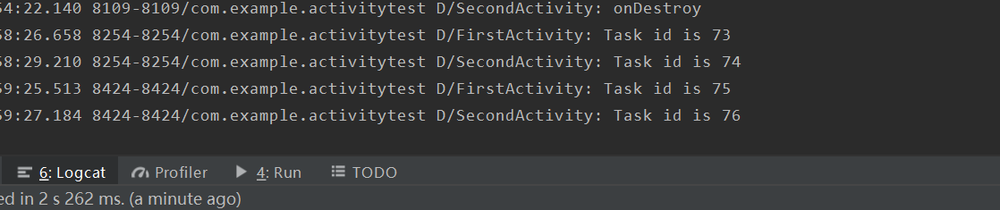

# 活动的启动模式
## 4种活动启动模式的说明文档
---
### standard
Android创建Activity时的默认模式，假设没有为Activity设置启动模式的话，默觉得标准模式。每次启动一个Activity都会又一次创建一个新的实例入栈，无论这个实例是否存在。 
每次被创建的实例Activity 的生命周期符合典型情况，它的onCreate、onStart、onResume都会被调用

### singletop
分两种处理情况：须要创建的Activity已经处于栈顶时，此时会直接复用栈顶的Activity。不会再创建新的Activity；若须要创建的Activity不处于栈顶，此时会又一次创建一个新的Activity入栈，同Standard模式一样。 
若情况一中栈顶的Activity被直接复用时，它的onCreate、onStart不会被系统调用，由于它并没有发生改变。可是一个新的方法 onNewIntent会被回调（Activity被正常创建时不会回调此方法）。 
如图，当SeconActivity再次调用FirstActivity时，由于SecondActivity在栈顶，所以FirstActivity会被再次创建实例

### singleTask
若须要创建的Activity已经处于栈中时，此时不会创建新的Activity，而是将存在栈中的Activity上面的其他Activity所有销毁，使它成为栈顶。 
如图，当SeconActivity再次调用FirstActivity时，由于SecondActivity在栈顶，所以SecondActivity会出栈，FirstActivity返回栈顶。

### singleInstanse
SingleInstance比較特殊，是全局单例模式，是一种加强的SingleTask模式。它除了具有它所有特性外，还加强了一点：具有此模式的Activity仅仅能单独位于一个任务栈中 
此时只有单独的一个活动在栈中。

