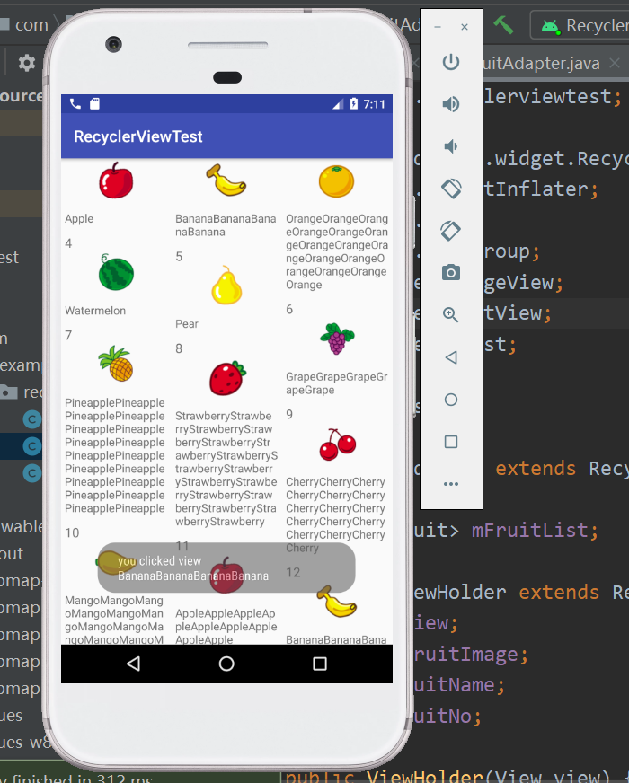

# RecyclerView，掌握RecyclerView的基本用法和RecyclerView的点击事件，在friut_item.xml文件中ImageView用于显示水果的图片，TextView用于显示水果的名称
## 实验图片截图

## 说明
在适配器中注册点击事件，显示点击事件。

        final ViewHolder holder = new ViewHolder(view);
        holder.fruitView.setOnClickListener(new View.OnClickListener(){
            public void onClick(View v){
                int position = holder.getAdapterPosition();
                Fruit fruit = mFruitList.get(position);
                Toast.makeText(v.getContext(),"你点击了" + fruit.getName() + "的文字",
                        Toast.LENGTH_SHORT).show();
            }
        });
        holder.fruitImage.setOnClickListener(new View.OnClickListener(){
            public void onClick(View v){
                int position = holder.getAdapterPosition();
                Fruit fruit = mFruitList.get(position);
                Toast.makeText(v.getContext(),"你点击了" + fruit.getName() + "的图片",
                        Toast.LENGTH_SHORT).show();
            }
        });

