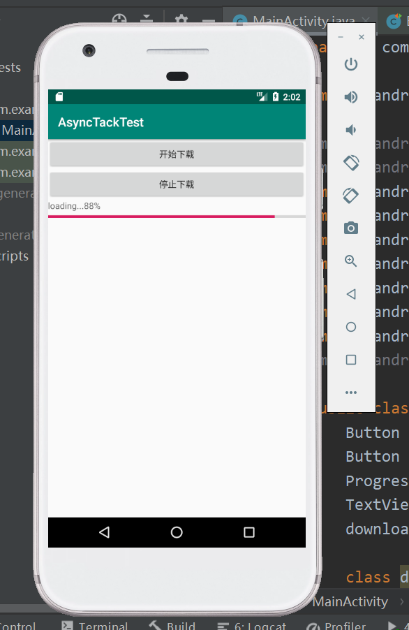
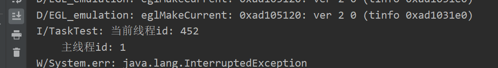

# 异步任务
## 项目截图

## 说明

借助AsyncTask，即使对异步消息处理机制完全不了解，也可以十分简单地从子进程切换到主进程，当然AsyncTask的实现原理也是基于异步消息处理机制，只是Android帮我们做好封装
AsyncTask是一个抽象类，使用它时想要创建一个子类去继承，在继承时，我们可以为AsyncTask类指定3个泛型参数
 
Params:执行AsyncTask时需要传入的参数，可用于在后台任务中使用。
 
Progress：后台任务执行时，如果需要在界面上显示当前的进度，使用这里指定的泛型作为进度单位。
 
Result：任务执行完毕后就对结果进行返回的类型。
## 要想该类能完成对任务的制定，还需要重写以下4个方法
1.onPreExecute()
这个方法会在任务开始执行之前调用，一般用来初始化界面
 
2.doInBackground(Params...) 这个方法中的所有代码会在子线程中执行
 
3.onProgressUpdate(Progress...) 当后台调用了publishProgress(Progress...)时，这个方法很快会被调用，它借助传递过来的进度参数更新界面
 
4.onPostExecute(Result) 当后台任务执行完毕并通过return语句返回时，这个方法很快会被调用，利用传递的参数进行一些UI操作

