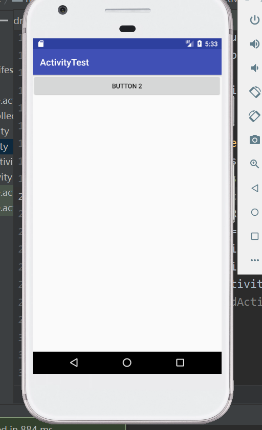
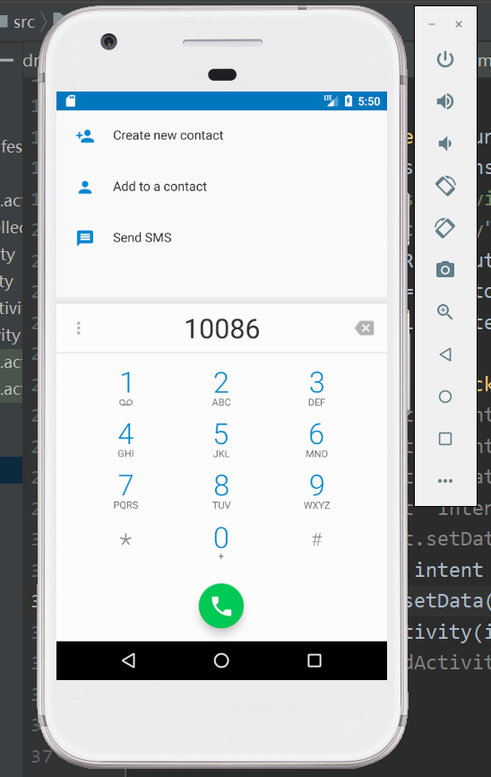

# 练习和掌握android的Intent，显式和隐式
## 实验图片截图

## 说明
图一为显式调用。即在通过Intent启动Activity时，需要明确指定激活组件的名称。在程序中，如果需要在本应用中启动其他的Activity时，可以使用显式意图来启动Activity。 
图二,三。为隐式调用。没有明确指定组件名的Intent称为隐式意图。Andorid系统会根据隐式意图中设置的动作（action）、类别（cetegory）、数据（Uri和数据类型）找到合适的组件

