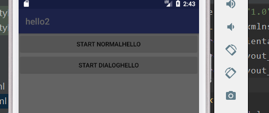
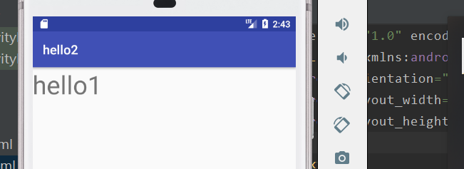
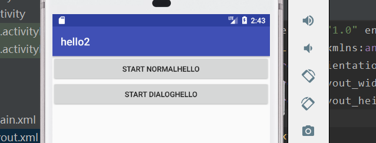
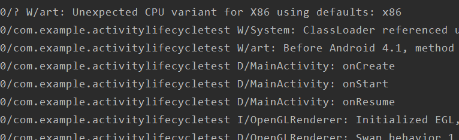
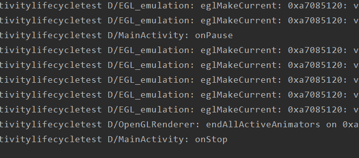
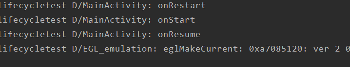
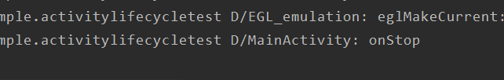
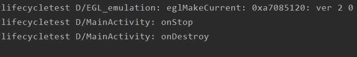

# 安卓第一次作业
##hello程序,展示生命周期的回调函数在不同条件下的触发条件和运行机制
#程序运行图片
 

 
***
#程序运行说明
程序有三个Activity,程序启动是，运行MainActivity,主界面有两个button,对应normalActivity和dialogActivity。
##回调函数说明
**当启动程序时，** 
activity第一次启动时调用onCreate，初始化activity所能使用的全局资源和状态。 
onStart,当activity对用户可见时调用，即activity展现在前端，一般用来初始化或启动与更新界面相关的资源.
 
onResume,当用户与activity进行交互时被调用，此时activity位于返回栈的栈顶，并处于运行状态，该方法完成一些轻量级的工作，避免用户等待。如下图： 

**当由主界面进入另一个activity时** 
首先调用onPause（），用来保存上一个activity界面的持久信息，提交未保存的数据，并释放消耗CPU的资源。 
 由于MainAcitivity被normalAcitivity覆盖，调用onStop（）：该方法在activity不可见状态时调用，

**由当前界面返回上一界面** 
返回MainActivity,onRestart上一个Activity,然后onStart,onResume.
 
**返回桌面，不退出应用** 
直接调用onStop暂停activity。不销毁activity。 
 
**退出应用** 
返回主界面，按返回界面，退出应用程序。
停止当前Activity时调用onStop,再调用onDestroy销毁activity

